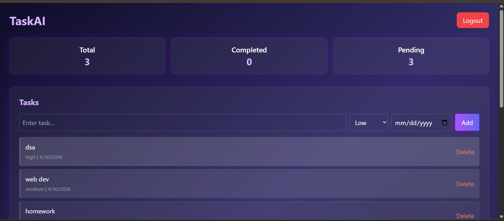
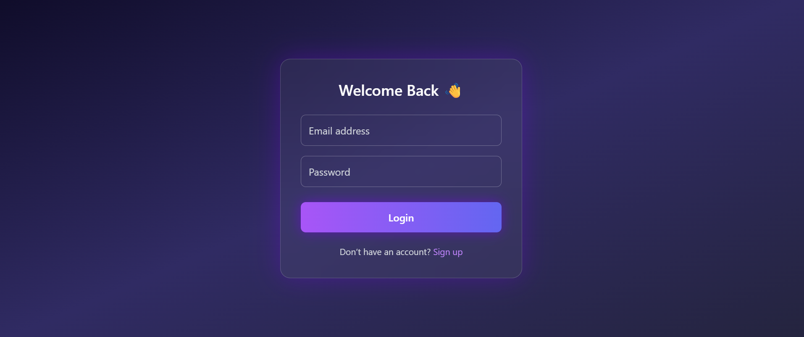
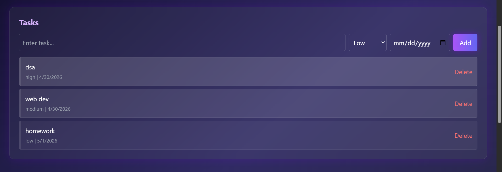
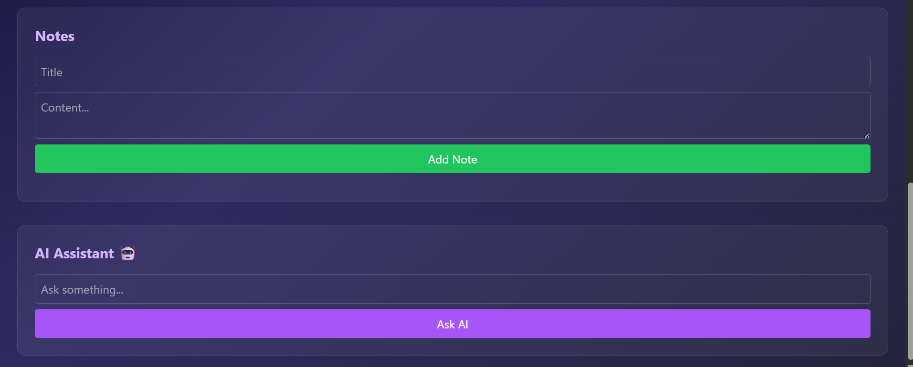

# 🚀 TaskAI – AI Powered Productivity App

🔗 **Live Demo:** https://task-ai-topaz.vercel.app/

---

## 📌 Overview

**TaskAI** is a full-stack AI-powered productivity web application designed to help users manage their daily tasks, notes, and learning workflow efficiently.

The app combines **task management + note-taking + AI assistance** to create a complete productivity system.

Modern productivity tools increasingly use AI for **task planning, organization, and decision-making**, making workflows faster and more efficient. TaskAI follows the same approach by integrating AI directly into the workflow.

---

## 🎯 Features

### 🔐 Authentication

* User Signup & Login
* JWT-based authentication
* Password hashing using bcrypt

---

### ✅ Task Management

* Add, edit, delete tasks
* Mark tasks as completed
* Set **priority (Low / Medium / High)**
* Add **due dates**
* Visual priority-based UI

---

### 📝 Notes System

* Create and manage notes
* Store study material, ideas, or AI responses
* Helps extend beyond simple to-do functionality

---

### 🤖 AI Assistant

* Ask study-related questions
* Get explanations instantly
* Generates structured responses
* Includes fallback system (works even without API quota)

AI-based productivity tools help users **organize tasks, generate insights, and automate workflows**, improving efficiency significantly ([Udemy Blog][1]).

---

### 📊 Dashboard

* Total tasks
* Completed tasks
* Pending tasks
* Real-time stats

---

### 🔔 Reminder System

* Implemented a basic reminder system using cron jobs that periodically checks pending tasks and triggers alerts based on due dates.
---

## 🏗️ Tech Stack

### 💻 Frontend

* React.js
* Tailwind CSS
* Axios

---

### 🌐 Backend

* Node.js
* Express.js
* JWT Authentication

---

### 🗄️ Database

* MongoDB (Atlas)

---

### 🤖 AI Integration

* OpenAI API (with fallback system)

---

### 🚀 Deployment

* Frontend: Vercel
* Backend: Render

---

## 🔄 Application Flow

User → Frontend (React) → Backend (Express API) → Database (MongoDB) → AI → Response → UI

---

## 📷 Screenshots

### 🏠 Dashboard


### 🔐 Login Page


### ✅ Tasks


### 🤖 AI Assistant



---

## ⚙️ Installation (Local Setup)

### 1️⃣ Clone repository

```bash
git clone https://github.com/your-username/taskai.git
cd taskai
```

---

### 2️⃣ Backend setup

```bash
cd backend
npm install
npm start
```

---

### 3️⃣ Frontend setup

```bash
cd frontend
npm install
npm run dev
```

---

### 4️⃣ Environment Variables

Create `.env` in backend:

```env
MONGO_URI=your_mongodb_url
JWT_SECRET=your_secret
OPENAI_API_KEY=your_key
```

---

## 📈 Future Improvements

* Drag & drop tasks
* Notifications UI
* Charts / analytics dashboard
* Real AI integration (with billing)
* Mobile responsiveness improvements

---

## 💡 Learnings

* Built a complete full-stack application
* Learned authentication & API integration
* Understood real-world deployment
* Worked with AI integration and fallback systems

---

## 📄 Resume Description

Built ***TaskAI***, a full-stack AI-powered productivity web application using React, Node.js, and MongoDB, featuring authentication, task and notes management, AI assistant integration, and a dashboard with real-time insights.
---

## 👨‍💻 Author

Developed by **Prashansha kumari**

---

⭐ If you like this project, give it a star on GitHub!


